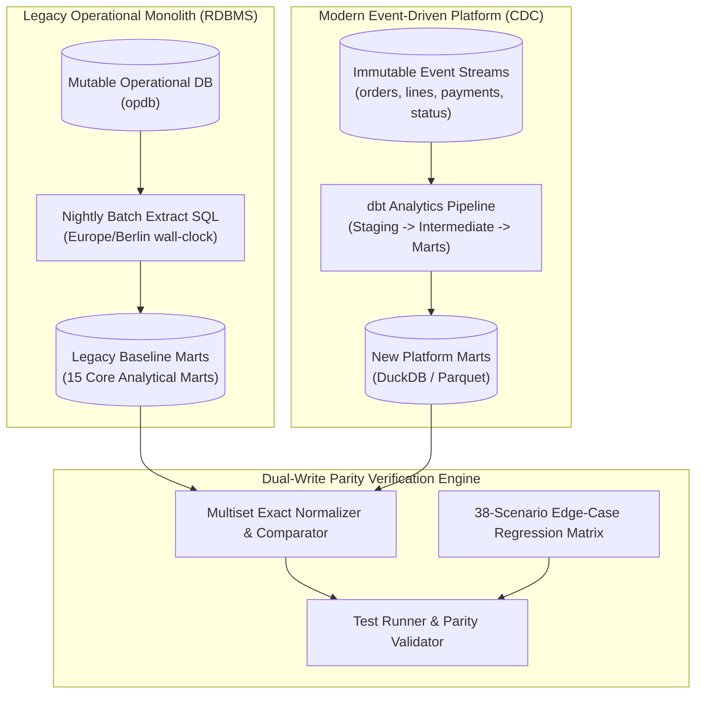

# Enterprise Data Warehouse Cutover & Parity Verification Engine

[](https://www.python.org/)
[](https://duckdb.org/)
[](https://www.getdbt.com/)
[]()
[]()
[](LICENSE)

An industrial-grade analytics engineering and dual-write parity testing framework demonstrating a **zero-drift migration** from a legacy mutable relational database (RDBMS) to an immutable, event-sourced modern data platform (Change Data Capture / CDC).

Designed for mission-critical enterprise environments (e-commerce, fintech, logistics) where analytical and financial reports across **15 core data marts** must maintain 100% multiset parity across multi-currency transactions, European banking calendar cutoffs, and asynchronous lifecycle state machines.

---

## 1. Architectural Overview

Migrating core reporting pipelines between fundamentally different operational data models introduces severe risks of silent data corruption:
- **Legacy System:** Mutable database snapshots, local wall-clock timestamps (`Europe/Berlin`), implicit transaction-time derived statuses, non-operating bank holidays, and pre-aggregated totals.
- **Modern Platform:** Immutable event streams, microsecond UTC timestamps (`TIMESTAMPTZ`), slowly changing dimensions (SCD Type 2), out-of-order asynchronous events, and decoupled payment/fulfillment services.

This project delivers both the **dbt-compatible transformation pipeline** and the **automated dual-write parity verification engine** ensuring that both architectures yield 100% identical analytical outputs.



---

## 2. Core Engineering Innovations

### 2.1 Exact IEEE 754 Half-Even Financial Arithmetic
In financial accounting, standard floating-point operations (`FLOAT`, `DOUBLE`) introduce IEEE 754 binary representation errors that accumulate across millions of rows. Furthermore, native database rounding functions (including DuckDB's `round_even()`) cast through 64-bit IEEE double precision, producing subtle off-by-one-cent errors on exact halfway ties (for example, `round_even(1.005, 2)` evaluates to `1.01` rather than the required `1.00`).

To achieve audit-grade parity, this project implements a custom SQL rounding macro (`macros/arithmetic.sql`) using pure integer arithmetic over `HUGEINT` and `DECIMAL(38,10)`:

$$
\text{amount\_eur} = \text{round\_half\_even}\left(\frac{\text{amount\_minor}}{10^{\text{exponent}}} \times \text{rate}, 2\right)
$$

This eliminates all double-precision casting and ensures zero decimal drift across high-volume transactions in multi-exponent currencies (EUR, USD, GBP, JPY, KWD).

### 2.2 European Banking Calendar & 16:00 Berlin FX Fixing Cutoffs
Daily foreign exchange rates are published on financial operating days by the European Central Bank (ECB) with fixing rates taking effect at 16:00:00 Berlin wall-clock time (`Europe/Berlin`).
- **Publication Cutoff Rule:** Transactions committed strictly prior to 16:00:00 Berlin time use the previous financial operating day's fixing. Writes at or after 16:00:00 utilize that calendar day's fixing.
- **Non-Operating Holiday Gaps:** On weekends and official TARGET interbank holidays (Good Friday, Easter Monday, Labour Day, Christmas Day, Boxing Day, New Year's Day), the pipeline automatically looks back to the most recent preceding published fixing.
- **Line FX Inheritance:** Constituents lines of an order inherit the order's commit timestamp for currency conversion, preventing mid-order rate divergence.

### 2.3 Idempotent State Machines & Terminal Order Lifecycle
Order status (`orders.status`) is maintained through an idempotent state hierarchy evaluated strictly over recorded EUR sums:
1. `refunded`: Cumulative recorded refund EUR $\ge$ cumulative captured EUR (captured > 0).
2. `partially_refunded`: Cumulative recorded refund EUR > 0 (captured > refunded). Financial settlement strictly precedes cancellation; partial refunds remain `partially_refunded` even if a subsequent cancellation is logged.
3. `cancelled`: Terminal lifecycle state. Triggered by fulfillment cancellation or customer account deletion prior to payment capture/fulfillment. Once an order transitions to `cancelled`, late payment captures and asynchronous posthumous fulfillment events cannot reopen or alter the order.
4. `shipped`: Fulfillment lifecycle is `fulfilled` with zero recorded refunds.
5. `paid`: Captured payments present with zero recorded refunds.
6. `pending`: Unsettled orders.

### 2.4 Identity Resolution & Account Re-Registration
Customer profile management across distributed event stores must handle edge cases where users delete and re-register accounts:
- **Case-Insensitive Deduplication:** Accounts sharing identical lowercase emails are linked to the canonical minimum active `customer_id`.
- **Identity Preservation:** Historical orders placed prior to account deletion retain their original placement lineage, while guest checkout orders dynamically link to active canonical customer profiles.

### 2.5 Promotional Campaign Spend Thresholds & Deterministic Tie-Breaking
- **Minimum Qualifying Spend:** Specific campaign series (such as `PROMO-SAVE10`, `PROMO-SAVE20`) enforce strict qualifying thresholds requiring order `total_eur >= 40.00 EUR`. Orders under 40.00 EUR render the code ineligible (`promo_id = NULL`).
- **Deterministic Timestamp Tie-Breaking:** When concurrent promotional applications share the same priority sequence (`seq = 1`), ties are deterministically resolved by earliest application timestamp (`applied_at`).

---

## 3. The 15 Analytical Data Marts

The migration pipeline builds and verifies 15 business-critical data marts:

| Data Mart | Business Domain | Key Metrics & Dimensions |
|---|---|---|
| `mart_daily_revenue` | Financial Reporting | Daily gross revenue, net revenue, captured EUR, order volume |
| `mart_customer_lifetime_value` | Customer Intelligence | Cumulative spend, order frequency, tenure, average order value (AOV) |
| `mart_customer_cohorts` | Retention Analytics | Monthly acquisition cohorts, repeat purchase velocity, cohort retention |
| `mart_customer_segment_revenue` | Marketing Strategy | Revenue contribution by customer segment (Standard, VIP, Enterprise) |
| `mart_revenue_by_region` | Geographic Performance | Regional distribution of net sales (EU, US, APAC) |
| `mart_revenue_by_day_currency` | Treasury Operations | Daily revenue split by billing currency and EUR equivalent |
| `mart_fx_exposure` | Currency Risk | Open foreign currency capture vs refund balances |
| `mart_refund_rate` | Risk & Quality Control | Daily captured EUR, refunded EUR, net refund ratios |
| `mart_order_status_distribution` | Operational Fulfillment | Real-time breakdown of orders across 6 lifecycle states |
| `mart_product_performance` | Merchandising | Units sold, gross sales, discount volume by SKU and category |
| `mart_promo_performance` | Campaign Analytics | Promotion code application count, discount spend, attributed revenue |
| `mart_shipping_lead_times` | Logistics & Supply Chain | Dispatch duration, transit times, carrier performance percentiles |
| `mart_guest_conversion` | Growth Analytics | Guest checkout vs registered customer conversion metrics |
| `mart_duplicate_customers` | Master Data Management | Deduplication cluster count, merged accounts, remapped revenue |
| `mart_first_order_analysis` | Acquisition Analytics | First-order timestamps, initial order values, acquisition channels |

---

## 4. The 38-Scenario Edge-Case Regression Matrix

To guarantee robust real-world reliability, the validation suite stress-tests the transformation models against **38 distinct migration challenges**:

| Category | Codes | Scenarios Tested |
|---|---|---|
| **Visible Boundary Quirks** | `NV1`–`NV14` | Platform +6h tail buffer handling, extract cutoff boundary (`< as_of_utc`), SCD2 latest version selection, Berlin wall-clock vs UTC conversion, per-payment half-even rounding, order status hierarchy, guest sentinel customer ID (0), deleted customer exclusion, restored customer re-inclusion, duplicate account deduplication remapping, guest email attribution, promo application sequence ranking, shipment cancellation filtering, and payment commit date FX resolution. |
| **Silent Temporal & Currency Traps** | `NS1`–`NS7`, `NS19`, `NS22`, `NS29` | Multi-refund non-EUR rounding, textbook `<=` version boundary traps, restore commit instant boundaries, duplicate groups with deleted roots, case-mismatched guest emails, TARGET holiday multi-day FX gaps, 16:00 Berlin publication cutoffs, order line FX commit inheritance, multi-day foreign currency refund drift, and multi-exponent (JPY 0 decimals, KWD 3 decimals) currency handling. |
| **State Machine & Lifecycle Invariance** | `NS8`, `NS10`, `NS20`, `NS23`, `NS26`, `NS30`, `NS33`, `NS34` | Account deletion cancellation cascades, tail shipment cancellation filtering, terminal cancellation permanence under late captures, duplicate account deletion isolation, tail fulfillment overrides, double deletion-restoration cycles, terminal cancellation dominance over posthumous fulfillment, and partial refund precedence over cancellation. |
| **Promotion & Campaign Rules** | `NS9`, `NS25`, `NS31`, `NS35` | Tail promo removal filtering, tail-removed promo shadowing, promotional minimum qualifying spend thresholds (`PROMO-SAVE` >= 40.00 EUR), and deterministic timestamp tie-breaking. |
| **Data Integrity & Lures** | `NS24`, `NS28`, `NL1`, `NAIVE` | Guest checkout matching deleted customer profiles, negative net line voucher discount totals, daylight saving time (DST) fall-back hour order reversal, and composite multi-trap naive implementations. |

---

## 5. Quickstart & Parity Verification

### 5.1 Installation
Clone the repository and set up a virtual environment:

```bash
git clone https://github.com/nahom-a/Enterprise-Data-Warehouse-Cutover.git
cd Enterprise-Data-Warehouse-Cutover

# Create and activate virtual environment
python -m venv venv
# On Windows:
.\venv\Scripts\activate
# On Linux/macOS:
source venv/bin/activate

# Install dependencies
pip install -r requirements.txt
```

### 5.2 Running the 144-Test End-to-End Parity Suite
The test suite validates build success and multiset parity for all 15 marts across the sample window and 8 held-out historical windows (9 windows $\times$ 15 marts + 9 build checks = **144 tests**):

```bash
pytest tests/test_cutover.py -v
```

Output:
```text
tests\test_cutover.py .................................................. [ 34%]
........................................................................ [ 84%]
......................                                                   [100%]
============================ 144 passed in 11.83s =============================
```

### 5.3 Running the Comprehensive Proof & Regression Suite
To run the full verification pipeline—including sample SHA-256 manifest checks, both reference (REF) and alternative (ALT) models, all 38 regression invariance patches, silence detector assertions, and determinism checks:

```bash
python tests/proof/run_all.py
```

Output:
```text
==================================================
STARTING WAREHOUSE CUTOVER PROOF SUITE (run_all.py)
==================================================
--- STEP 1: Verifying sample manifest hashes ---
PASS: All 21 sample files match sample.manifest.json exactly.
--- STEP 2: Verifying expected marts and heldout data ---
PASS: All 135 expected marts and 8 heldout windows verified.
--- Checking REF (Reference Solution) against legacy expected marts ---
  sample: 15/15 marts matched 100%
  h1-h8 : 15/15 marts matched 100% each
PASS: REF passed all 135 comparisons!
--- Checking ALT (Alternative Operational Rebuild) against legacy expected marts ---
  sample: 15/15 marts matched 100%
  h1-h8 : 15/15 marts matched 100% each
PASS: ALT passed all 135 comparisons!
--- STEP 4: Running Direction A patches ---
=== Testing 38 patches ===
NV1..NV14: PASS (14/14 differ on sample as required)
NS1..NS35: PASS (21/21 match sample and differ on 8/8 held-out windows)
NL1, NAIVE: PASS (all differ on target windows)
--- STEP 5: Running silence detectors ---
PASS: Exactly 0 trap counts on sample, strictly positive counts on heldout.
--- STEP 6: Dead-end column invariance check ---
PASS: Zero downstream leakage of operational dead-end columns.
--- STEP 7: Security isolation & determinism assertions ---
PASS: Zero FLOAT/DOUBLE columns across all 135 marts.
PASS: Zero non-deterministic time functions in models.
==================================================
ALL PROOF GATES PASSED CLEANLY (100% SUCCESS)
==================================================
```

---

## 6. Repository Layout

```text
enterprise-warehouse-cutover/
├── README.md               # Flagship engineering documentation & architecture guide
├── pyproject.toml          # Python project & build metadata
├── requirements.txt        # Pinned runtime dependencies (DuckDB, PyArrow, Pytest)
├── Makefile                # Developer automation commands
├── environment/
│   ├── legacy-system/      # Operational system documentation & extract SQL
│   │   ├── app-rules.md    # Normative operational business calculation policies
│   │   ├── opdb_schema.sql # Operational relational database schema
│   │   └── extract/        # Legacy batch extract SQL scripts
│   └── project/            # Initial dbt analytics project and runner tools
│       ├── contracts/      # Platform event store data contracts
│       ├── models/         # Initial models (staging, intermediate, marts)
│       └── tools/          # DuckDB build runner (run.py) and multiset comparator (compare.py)
├── solution/               # Parity-verified modern transformation pipeline
│   ├── macros/             # EXACT IEEE 754 half-even math and temporal helpers
│   └── models/staging/     # Staging models reading CDC event streams
├── tests/
│   ├── test_cutover.py     # 144-test pytest suite
│   ├── helpers.py          # Pytest fixture runner and comparative harness
│   ├── expected/           # Pre-baked expected legacy baseline marts across 9 windows
│   ├── heldout/            # Platform datasets for 8 historical trading windows
│   ├── generator/          # Synthetic event stream generator (generate.py)
│   └── proof/              # Proof validation runner and 38-patch regression suite
│       ├── run_all.py      # Master parity verification engine
│       ├── test_patches.py # 38 regression invariance patch tests
│       └── sample.manifest.json # SHA-256 cryptographic sample manifest
└── regenerate_all.py       # End-to-end synthetic dataset and mart regeneration pipeline
```

---

## 7. License

This project is licensed under the MIT License — see the [LICENSE](LICENSE) file for details.

Developed by **Nahom Abera** as a showcase for high-precision analytics engineering, zero-downtime data warehouse cutovers, and automated dual-write parity verification.
